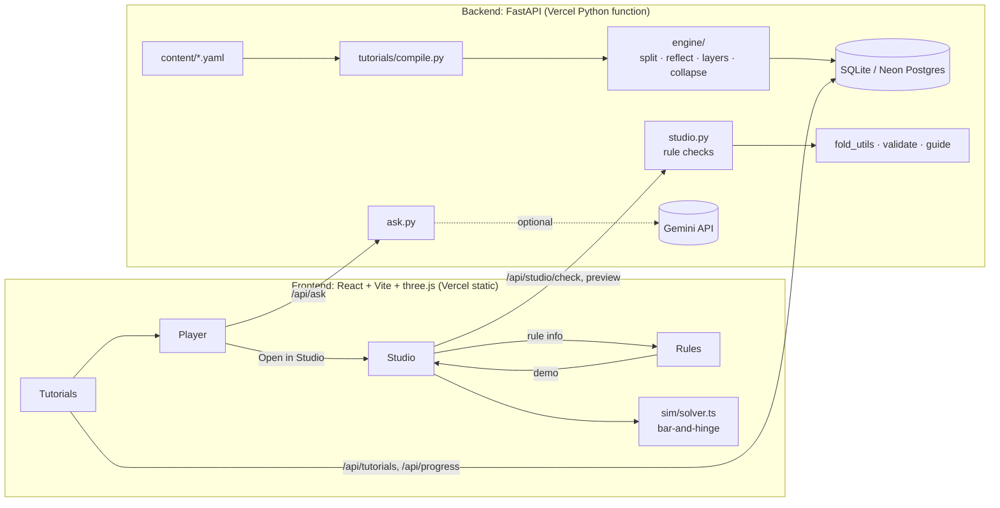

# CreaseLens

An origami learning platform with a real fold engine, in three parts: **Tutorials**, step-by-step lessons
where every fold is simulated; the **Studio**, where you design your own crease patterns with live rule
checks and a physics preview; and **Rules**, the rules of flat folding and their exceptions (also linked
from the Studio's rule panel).

Live: https://final-project-origami.vercel.app

## Gap

Origami is taught with diagrams (step sequences) or crease patterns (the finished crease map).
Each leaves a gap for learners:

- Diagrams show steps but not why a model folds, and they are static.
- Crease patterns, the format behind FOLD files and tools such as ORIPA and Origami Simulator
  (Ghassaei, Demaine & Gershenfeld, 7OSME 2018), show the whole design at once but no order of folding.
  Generating folding sequences from crease patterns is an open research problem (Akitaya et al. 2013).
- Kosmulski's origami-AI roadmap points out that machine understanding of origami needs a simulated,
  checkable representation of each step, not just pictures.

CreaseLens connects the two views: every tutorial step runs through a fold engine, so the player shows
the folded paper in 3D next to the sequenced crease pattern, and the Studio checks the same rules the
engine relies on.

## Features

- **Tutorials:** 24 tutorials in 11 categories (foundations, bases, animals, birds, flowers, boxes, planes,
  action, masks, modular, tessellations), filterable by category, difficulty level (1–5) and search.
  Finished tutorials get a tick (a guest id is created silently; there is no sign-up).
- **Player (dual viewport):** the unfolded crease pattern so far (current crease animated, earlier ones
  dimmed) beside a 3D view of the folding paper. Hovering the current crease highlights its fold axis in
  3D and vice versa. Prev / play / next, step dots, fold-progress scrub, 0.5×/1×/2× speed, replay, tips and
  common mistakes behind one "i" toggle, ✓ Done, "Ask" and "I'm stuck" (Gemini with a template fallback),
  and "Open in Studio".
- **Rules:** Maekawa, Kawasaki, even degree, big-little-big, two-colourability, no self-intersection,
  Huzita–Justin axioms, diagram symbols and paper rules, each with exceptions (kirigami, modular,
  wet-folding/curved creases, 3D shaping, rectangles, tessellations, action models) and demo patterns that
  open in the Studio.
- **Studio:** draw valley, mountain and reference lines on a 4/8/16/32 grid with snapping to grid points,
  crossings and 22.5° angles; axiom tools (point→point, line→line); select, erase, undo/redo; templates
  (blank, kite, square base, waterbomb, Miura-ori); import/export `.fold` and `.svg`; save and reopen
  "My patterns".
  A rules panel re-checks the pattern 300 ms after each edit (with exception toggles) and highlights failing
  vertices in both views.
- **Physics preview:** our own bar-and-hinge solver with a fold % slider, a strain heatmap (viridis or
  green→red, with legend), grab-and-pull with the mouse or the keyboard, and a hinge-animation fallback.

## Architecture



Tutorials are YAML in `backend/content/tutorials/`. At startup the backend compiles each one through the
engine (cached in the database by content hash) and serves the compiled keyframes.

## Algorithms

**Fold engine** (`backend/app/engine/`). The state is a list of *pieces*: flat polygons in paper
coordinates, each with a 3×3 affine map `M` (possibly a reflection) into folded coordinates and a layer
number. A fold:
1. picks the moving side (the side holding the `move` point, else the smaller area);
2. selects the layers (all, the top *n* under a point, the front half, or a paper region);
3. splits each selected piece by the line in folded coordinates (shapely), mapping the halves back with M⁻¹;
4. reflects the moving halves (`M' = Reflect(line) · M`) and restacks them on top (valley) or below
   (mountain), reversing their order;
5. records the crease, the line ∩ piece in paper coordinates, as V or M relative to the paper's front.

`crease` folds and unfolds; `turn_over`, `rotate` and `unfold` transform or restore the stack.

**Line construction:** fold lines come from Huzita–Justin axioms 1–5 in current folded coordinates, with
point references such as `P(x,y)` (where a paper point is now), `B(u,v)` (bounding-box fractions) and
named corners.

**Collapse via the face tree:** for a flat, creased sheet, the creases become a FOLD crease pattern. Faces
form a BFS tree crossing M/V creases; each face's flat-folded position composes the reflections along its
path (`guide.py`). Layer order is approximated by folding every hinge to 0.95π in 3D and sorting faces by
height. Creases that stay flat in the finished base (such as the front diagonal of the square base) are
marked in the YAML.

**Bar-and-hinge solver** (`frontend/src/sim/solver.ts`, after Ghassaei, Demaine & Gershenfeld).
Faces are triangulated; every triangle edge is a stiff axial bar; every M/V edge is a crease hinge with
target angle ±fold% × π (valley +, toward the viewer); triangulation edges and reference lines are stiff
facet hinges with target 0. Dihedral forces use the four-vertex hinge gradient (Bridson et al. 2003), and
the system is integrated explicitly with velocity damping, 30 substeps per frame. The first face is pinned.
Vitest checks that a single valley reaches fold% × π within 500 steps and that bar strain stays under 1%.

**Rule checks** (`backend/app/studio.py`): at every interior vertex, Maekawa (|M − V| = 2), Kawasaki
(alternate sectors sum to 180°), even degree, big-little-big (creases around a strictly smallest sector
differ), and a face 2-colouring across folds. Exceptions skip checks: cuts treat cut vertices as boundary,
non-flat skips the flat-folding rules, curved skips the angle rules.

## Accessibility

Built to WCAG 2.2 AA:
- **Contrast and colour:** text contrast is at least 4.5:1 and UI contrast at least 3:1 on the dark
  palette. Colour is never the only signal: mountains are dash-dot and valleys dashed, with M/V labels on
  hover and focus, and the strain heatmap has a legend and a colour-blind-safe viridis ramp.
- **Controls and keyboard:** every icon button has an `aria-label`, a tooltip and a 2px accent focus ring.
  The whole app works from the keyboard: ←/→ steps, Space play, [ ] fold %, 1–6 Studio tools,
  Ctrl+Z/Ctrl+Y undo/redo, ? for the shortcut list, and keyboard grab in the simulator (Enter, Tab,
  arrows, PageUp/PageDown, Escape).
- **Screen readers:** an `aria-live` region announces each step's instruction, and 3D canvases carry a
  description of the current state.
- **Reduced motion:** `prefers-reduced-motion` turns off auto-play and makes step transitions instant.
- **Structure:** a skip link, semantic landmarks, a 15px base font and 36px or larger hit targets.
- **Automated check:** `@axe-core/react` runs in development; an audit of every route reports no serious
  or critical issues.

## Limitations

- Layer order is approximate after a collapse, and the 3D preview can show layers passing through each other.
- Shaping steps (inflating, opening boxes, reverse folds that need 3D) are illustrated, not simulated.
- The physics solver runs on the CPU; very large patterns (thousands of vertices) will be slow.
- The engine moves only the layers a step selects, so some tutorials use paper-region selection to model
  connected flaps.

## Future work

- A layer-order solver (such as Flat-Folder) for exact stacking after collapses.
- Crease-pattern detection from images (the v1 detector is archived in `backend/app/_archive/`).
- Camera-based checking of the learner's fold at each step.

## Run locally

Requirements: Python 3.11+ and Node 20+.

**Windows, one click:** double-click `start-local.bat`. It opens http://localhost:5173.

**Manually:**

```bash
cd backend
python -m venv .venv
.venv/Scripts/python -m pip install -r requirements.txt   # macOS/Linux: .venv/bin/python
.venv/Scripts/python -m pytest -q
.venv/Scripts/python -m uvicorn app.main:app --port 8000
```

```bash
cd frontend
npm install
echo VITE_API_URL=/ > .env.local
npm run dev
```

Other commands:
- `npm test` in `frontend/` runs the solver tests.
- `python -m app.tutorials.compile --all --render` compiles every tutorial and writes PNGs per step to
  `backend/.renders/`.
- `python -m scripts.export_mocks` refreshes `frontend/src/mock/` (offline data).

Without `VITE_API_URL` the frontend runs on the bundled mocks: Tutorials, the player and Rules work;
progress, Ask, Studio checks and saving need the backend.

### Environment variables

| Variable | Where | Default |
|---|---|---|
| `GEMINI_API_KEY` | backend | unset: template answers |
| `GEMINI_MODEL` | backend | `gemini-2.5-flash` |
| `DATABASE_URL` | backend | local `sqlite:///./creaselens.db`; on Vercel a temporary SQLite in `/tmp` |
| `FRONTEND_URL` | backend | only if the frontend is on another domain |
| `VITE_API_URL` | frontend | unset: mocks; `/` for same origin |

## Deploy (free, Vercel)

One Vercel project serves the static frontend and the FastAPI function (`api/index.py`). Pushing to `main`
redeploys. For progress ticks and saved patterns to persist, add a Neon Postgres database under
**Storage** (it sets `DATABASE_URL`) and redeploy. Optionally set `GEMINI_API_KEY` for AI answers.

## References

- H. Akitaya, J. Mitani, Y. Kanamori, Y. Fukui. Generating folding sequences from crease patterns of
  flat-foldable origami. SIGGRAPH 2013 Posters.
- A. Ghassaei, E. Demaine, N. Gershenfeld. Fast, interactive origami simulation using GPU computation.
  Origami⁷ (7OSME), 2018.
- R. Bridson, S. Marino, R. Fedkiw. Simulation of clothing with folds and wrinkles. SCA 2003.
- E. Demaine, J. Ku, R. Lang. FOLD file format. https://github.com/edemaine/fold
- M. Bern, B. Hayes. The complexity of flat origami. SODA 1996.
- T. Hull. On the mathematics of flat origamis. Congressus Numerantium 100, 1994.
- K. Kosmulski. Origami-AI roadmap.
