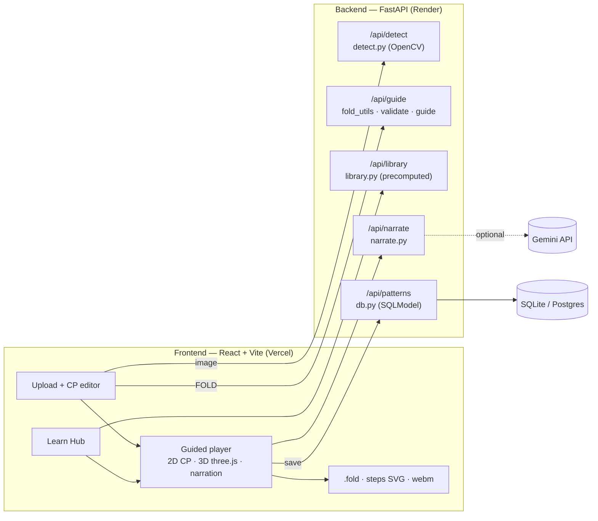

# CreaseLens

**Learn to fold from any crease pattern.** CreaseLens turns a crease pattern (CP) — the blueprint
format of modern origami — into a guided lesson: a sequenced crease pattern, a 3D fold animation
and beginner-friendly narration. Pick a model from the Learn Hub, or upload a screenshot of a CP.

## Problem and gap

Crease patterns show every crease of a finished model at once, but not the order in which to fold
them. Designers such as Robert Lang publish many models *only* as CPs, so they are hard for beginners
to use. Existing tools help in different ways, but none closes the loop from a picture to a lesson:

- **ORIPA** and **Origami Simulator** (Ghassaei, Demaine & Gershenfeld, 7OSME 2018) edit and simulate
  CPs that are already digital, and they show the folded result rather than a sequence of steps.
- Research on generating folding sequences from CPs (Akitaya, Mitani, Kanamori & Fukui 2013) shows the
  problem is tractable for restricted cases, but it is not available as a beginner-facing tool.
- Deciding whether a CP folds flat is NP-hard in general (Bern & Hayes 1996), so any practical tool must
  rely on local checks and heuristics.

CreaseLens combines image detection, local flat-foldability checks, a step-ordering heuristic and a
3D preview in one web app.

## Features

- **Learn Hub** with three categories — Bases, Tessellations and Modular — and eight built-in models
  generated by code (kite, preliminary, waterbomb and fish bases; accordion pleat, Miura-ori and square
  twist; the Sonobe unit with an assembly step). Every model passes validation in the test suite.
- **Guided player**: the sequenced CP (done / current / not yet), a 3D animation, a step list, play,
  scrub, "Done ✓", "I'm stuck" and read-aloud.
- **Upload**: a screenshot (PNG/JPG up to 5MB) or a `.fold` file → detected-line overlay → an editable
  CP (click a crease to cycle M → V → F → delete, or add lines snapped to the grid) → live
  Maekawa/Kawasaki validation with red/green vertex dots → a generated guide.
- **Narration** rewritten by Gemini (`gemini-2.5-flash`), with a template fallback when there is no key.
- **Exports**: `.fold` (opens in Origami Simulator / ORIPA), the sequenced CP as a multi-panel SVG, and
  a `.webm` video of the whole guide.
- **Saved patterns** (SQLite locally, Postgres such as Neon in production).

## Architecture



All geometry uses [FOLD](https://github.com/edemaine/fold) JSON in the unit square, y up.

## Algorithms

**Detection** (`backend/app/detect.py`, classical CV — no ML):
1. Resize so the longest side is 1200px.
2. Find the CP square (largest 4-point contour of the ink mask) and warp it to 1024×1024.
3. HSV colour masks: red (mountain), blue (valley), dark (edge) and grey (reference). A morphological
   close joins the dashes of valley lines.
4. `HoughLinesP` at three thresholds / minimum lengths, so short creases are not lost.
5. Snap each raw segment's angle to the nearest 22.5° multiple (within 3°), then merge collinear pieces
   (angle within 2°, offset within 6px) into maximal segments.
6. Extend endpoints that stop just short of a crossing line or the border.
7. Detect the grid — the smallest N ∈ {4, 8, 16, 32} for which ≥85% of endpoints lie on grid points or
   22.5° reference points — and snap endpoints to it.
8. Interior crease endpoints must meet another crease, so dangling ends are extended to the next hit
   and short spurs are dropped. Build the FOLD graph (split at intersections, merge vertices within
   1e-3, compute faces by planar traversal).
9. Confidence = mean snap score × share of vertices that pass validation.

**Validation** (`validate.py`): at every interior vertex with mountain/valley creases,
*Maekawa* requires |#M − #V| = 2 and *Kawasaki* requires the alternate sector angles to sum to 180°
(so the degree must be even). These are local, necessary conditions only.

**Step heuristic** (`guide.py`): collinear edges are merged into lines. Edge-to-edge lines through the
centre become *reference* steps (book folds, then diagonals). The other edge-to-edge lines become
*precrease* steps, grouped by direction (0°, 90°, 45°, 135°, then others) and ordered by grid level
(1/2, then 1/4, then 1/8…); more than 12 lines in one group are merged into a single step. Everything
else is a final *collapse*. Text uses reference-finding language ("Fold the left edge to the centre
line", "Kite fold: fold the bottom edge onto the diagonal").

**Hinge animation** (`frontend/src/fold/animate.ts`): faces form a BFS tree from the centre face,
crossing mountain/valley edges. Each face's transform is its parent's transform times a rotation about
the hinge crease by `sign · t · 0.98π` (valley +, toward the viewer). Single-line steps clip the square
into two pieces (Sutherland–Hodgman) and fold one piece and back.

**Folded state** (`guide.py`): composing reflections across the hinge lines along each face's tree path
gives every vertex's flat-folded 2D position (`folded_coords`), used by the interpolation fallback.

## Evaluation

`python -m app.eval` renders 40 synthetic CPs (the library plus random 8×8 / 16×16 grid patterns
with 22.5° lines) at three augmentation levels and matches detected creases to the ground truth
(endpoints within 1.5% of the side, same assignment). It runs in about 10 seconds on the development
laptop.

| Augmentation | Images | Precision | Recall | F1 | M/V accuracy | Validates (GT-valid only) | Mean runtime |
|---|---|---|---|---|---|---|---|
| clean | 14 | 0.952 | 1.000 | 0.975 | 1.000 | 100% | 164 ms |
| mild | 13 | 0.947 | 1.000 | 0.973 | 1.000 | 67% | 187 ms |
| hard | 13 | 0.897 | 0.980 | 0.937 | 1.000 | 0% | 192 ms |
| all | 40 | 0.930 | 0.993 | 0.960 | 1.000 | 70% | 181 ms |

*mild* = noise, blur and JPEG quality 60; *hard* = mild plus ±5° rotation, perspective warp and a desk
background. The full report is in [docs/eval_results.md](docs/eval_results.md). Crease-level accuracy
stays high under augmentation, but a single extra or missing crease breaks validation, so whole-pattern
validity drops quickly on hard images.

## Limitations

- **No layer ordering.** Validation checks local conditions only; global flat-foldability is NP-hard.
- **Simultaneous-fold preview.** The collapse animation rotates every face at once, so layers can pass
  through each other. It is labelled "simplified preview".
- **Clean digital input works best.** The detector is tuned for red/blue CP screenshots; photos of paper
  and unusual colour schemes are much less reliable.
- The step heuristic only sequences full edge-to-edge lines; everything else happens in one collapse.
- Video export records in real time and needs the tab to stay visible.

## Future work

- A layer-order solver (such as Flat-Folder) for true flat-folded states and collision-free animation.
- A detector trained on photos of real paper.
- Camera-based checking of the user's fold at each step.

## Run locally

Requirements: Python 3.11+, Node 20+.

```bash
cd backend
python -m venv .venv
.venv/Scripts/python -m pip install -r requirements.txt   # on macOS/Linux: .venv/bin/python
.venv/Scripts/python -m pytest -q
.venv/Scripts/python -m uvicorn app.main:app --port 8000
```

```bash
cd frontend
npm install
echo VITE_API_URL=http://localhost:8000 > .env.local
npm run dev
```

Without `VITE_API_URL` the frontend runs on the built-in mocks in `frontend/src/mock/` (Hub and
player only). Useful scripts:

- `python -m app.eval` — detection evaluation, writes `docs/eval_results.md`
- `python -m scripts.export_mocks` — refresh the frontend mocks from the real API
- `python -m scripts.make_samples` — re-render `frontend/public/samples/`

### Environment variables

| Variable | Where | Default |
|---|---|---|
| `GEMINI_API_KEY` | backend | unset → template narration |
| `GEMINI_MODEL` | backend | `gemini-2.5-flash` |
| `FRONTEND_URL` | backend (CORS, comma-separated) | — (`http://localhost:5173` is always allowed) |
| `DATABASE_URL` | backend | `sqlite:///./creaselens.db` |
| `VITE_API_URL` | frontend | unset → mocks |

## Deploy

- **Backend (Render):** New → Blueprint → select this repo (`render.yaml`, root `backend`). Set
  `GEMINI_API_KEY`, `FRONTEND_URL=<vercel url>` and optionally `DATABASE_URL` (Render's free disk is
  wiped on redeploy, so use Neon Postgres for saved patterns).
- **Frontend (Vercel):** import the repo, root directory `frontend`, env `VITE_API_URL=<render url>`,
  then redeploy. `vercel.json` rewrites every route to the SPA.
- The Render free tier sleeps when idle; the app shows "Waking up the server…" during the 30–60s cold
  start. Open the API URL a couple of minutes before a demo.

## References

- E. Demaine, J. Ku, R. Lang. FOLD file format. https://github.com/edemaine/fold
- M. Bern, B. Hayes. The complexity of flat origami. SODA 1996.
- T. Hull. On the mathematics of flat origamis. Congressus Numerantium 100, 1994.
- H. Akitaya, J. Mitani, Y. Kanamori, Y. Fukui. Generating folding sequences from crease patterns of
  flat-foldable origami. SIGGRAPH 2013 Posters.
- A. Ghassaei, E. Demaine, N. Gershenfeld. Fast, interactive origami simulation using GPU computation.
  Origami⁷ (7OSME), 2018.
